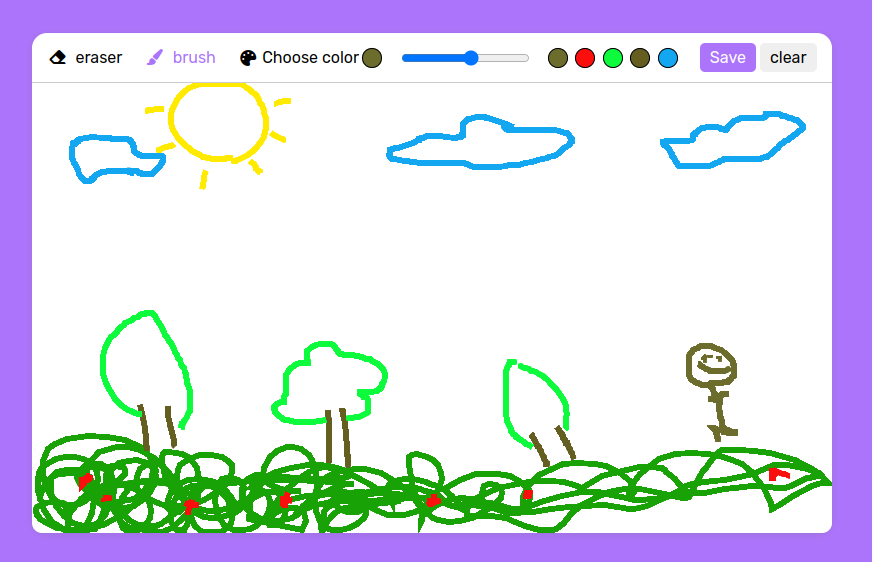
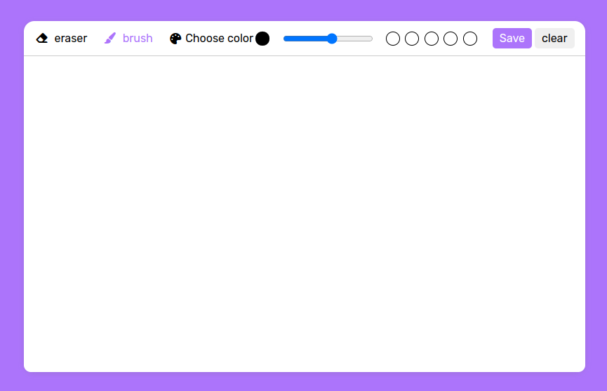

<h1>Art Canvas </h1>

    the implemented digital painting is built using 
    HTML, CSS, and JavaScript. In this painting, you will be able to utilize 
    various tools such as a brush, eraser, color picker, and brush width adjustment.
    Additionally, you can save color settings and also save the image of your artwork.
    This code draws colored lines on an HTML5 canvas using mouse events and form controls in JavaScript.

 
 

  
<h2>Features</h2>
<ul>
    <li>
        

            <strong>Eraser :</strong>  If you want to delete a line or make corrections, the eraser functionality enables you to remove specific parts of the drawing. You can use it to erase lines or areas that need to be modified.
        

    </li>
    <li>
        

            <strong>Color selection:</strong> You can choose your desired color for the drawing tool. This feature allows you to use different colors in your artwork and precisely select the preferred color.
        

    </li>
    <li>
        

            <strong>Brush width :</strong>  In this digital painting, you can adjust the width of the brush. This feature enables you to create lines of different thicknesses, adding more variety and detail to your artwork.
        

    </li>
    <li>
        

            <strong>Save color settings :</strong> A feature that allows you to save 5 color histories and use them.
        

    </li>
    <li>
        

            <strong>Clear the entire canvas:</strong>This option allows you to remove all the content on the canvas, including lines, drawings, and colors, effectively resetting the canvas for a fresh start.
        

    </li>
</ul>
<h2>Installation</h2>

To use this Art Canvas, follow the instructions below:

<ol>
    <li>
        
Clone the repository:

        <pre><code> https://github.com/Hanieh-Sadeghi/Draw-Verse
</code></pre>
    </li>
    <li>
Open the project folder in your preferred code editor.
</li>
    <li>
        

            Launch the application by opening the
            <code>index.html</code> file in a web browser.
        

    </li>
</ol>
<h2>Technologies Used</h2>

    The following technologies and libraries were used to develop this Art Canvas:

<ul>
    <li>
        <strong>HTML</strong>: The standard markup language for creating the
        structure and elements of web pages.
    </li>
    <li>
        <strong>CSS</strong>: The style sheet language used for designing the
        visual presentation of web pages.
    </li>
    <li>
        <strong>JavaScript</strong>: The programming language that enables
        dynamic behavior and interactivity in web applications.
    </li>
    
</ul>

